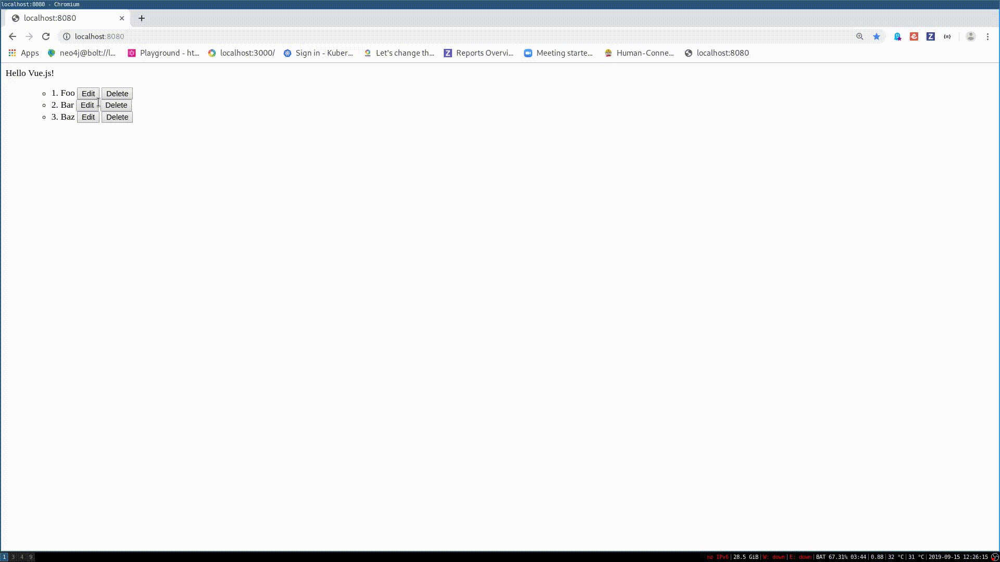

# ToDo List with VueJS

To execute:

* Install npm
* Install vue cli: "npm install -g @vue/cli"
* Run "npm install" in the VueJS Folder
* Run "npm run serve' in the VueJS Folder

<<<<<<< HEAD:VueJS/README.md
=======
* Edit: display a form to update the todo
* Save: update the todo and display it
* Cancel: cancel the form submission
* Delete: delete the todo

Here is how the result should look like:

Use computed properties and events where possible and make use of the component
pattern.

Get extra praise for implementing the "Add todo" button! :heart:
>>>>>>> origin/master:1/README.md
