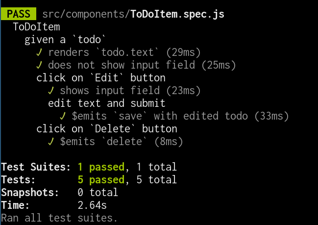

# Exercise \#2

Write test for your existing code.

This is not exactly test driven development, because you do the implementation
first and add the automated tests later. Don't worry, we keep the test driven
development for the upcoming exercises. However, do mutant testing in order to
double-check if your tests actually fail for a bug in your code.

1. Add a linter to your project, e.g. `eslint` or `prettier`.
2. Test your components with `jest` and `vue-test-utils`. Here is some
   inspiration how the tests could be structured:
   
3. Setup a build server. If your linter or your tests fail, that should fail the
   build.
4. Integrate your build server status into your repository, i.e. your build
   server tests each of your pull requests and you can see the result on the
   pull request. You can also add a badge to your `README.md`.
5. Request a review from @roschaefer
6. Request a review from a member of another team
7. Review a pull request of another group. Either "Request Changes" or
   "Approve". Give suggestions by clicking on the line of code that needs
   improvement.

If you copy code from other groups, please give credit to them in your commit
messages.
