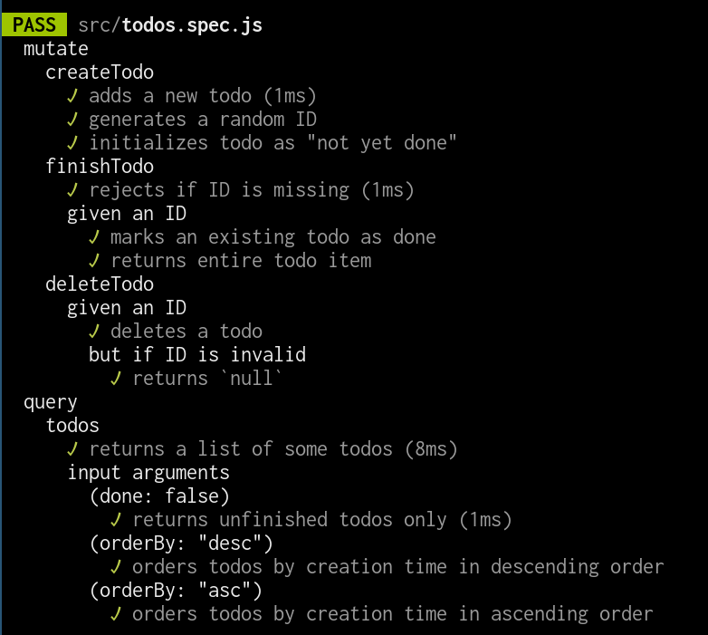
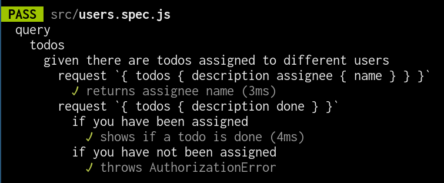

# Exercise \#3

Test-drive the development of a GraphQL server.

1. Setup an [apollo-server](https://www.apollographql.com/docs/apollo-server/).
2. Test drive your integration tests. As a first step, you can just write down
   the documentation, e.g.
   ```js
   it.todo("behaves in a specified way")
   ```
   will create a to-be-implemented test case with this description.
3. Implement your tests with [apollo-server-testing](https://www.apollographql.com/docs/apollo-server/testing/testing/).
   Pro tip: I run queries and mutations against an apollo server and check the
   response with jest's [`toMatchObject`](https://jestjs.io/docs/en/expect#tomatchobjectobject)
   matcher all the time. You can use it to check for errors as well.
4. Write type definitions for your schema. Please have at least one attribute
   which returns another custom type. E.g. a todo has an assignee, see point 6.
5. Implement a backend server with [apollo-server](https://github.com/apollographql/apollo-server).
   Your queries and mutations should roughly map the CRUD operations for your
   todo app of exercise 1 and 2. You should also implement the behaviour of some
   common input arguments. Here is some inspiration:
   
6. Implement a permission layer around your app. Use [graphql-shield](https://github.com/maticzav/graphql-shield)
   and [graphql-middleware](https://github.com/prisma-labs/graphql-middleware).
   Here is some inspiration how your test cases could look like:
   
7. Configure your build server to run all software tests, both frontend and
   backend.
8. If you use [JWT](https://jwt.io/) for authentication I will be impressed.
9. If you want to be super cool, connect your frontend with your backend via
   [vue-apollo](https://github.com/vuejs/vue-apollo). Implement your fronted in
   a way that calls the respective backend mutations if you click on a button.
10. Request a review from @roschaefer
11. Request a review from sb. else


If you copy code from other groups, please give credit to them in your commit
messages.
