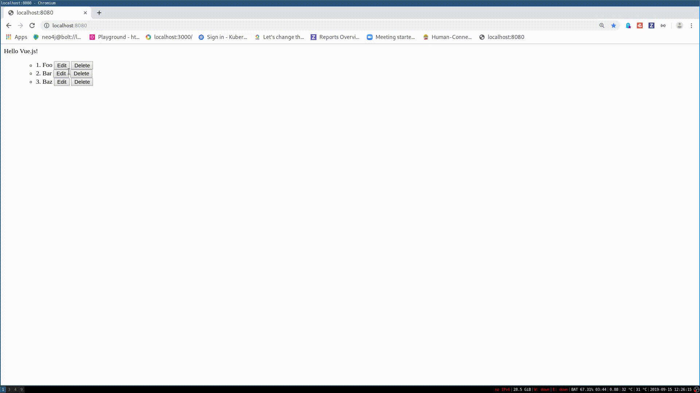

# Systems Development and Frameworks - Group Assignments - Winter Term 2019/20

| Github Alias                                         | Name         |
| ---------------------------------------------------- | ------------ |
| [@martinneumann](https://github.com/martinneumann)   | Martin N.    |

# Exercise \#1

Implement a simple todo app with VueJS.

Each item in the todo app should:

* Edit: display a form to update the todo
* Save: update the todo and display it
* Cancel: cancel the form submission
* Delete: delete the todo

Here is how the result should look like:

Use computed properties and events where possible and make use of the component
composition pattern.
