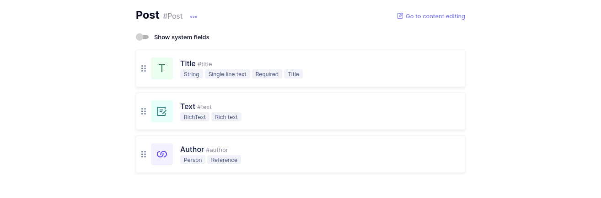
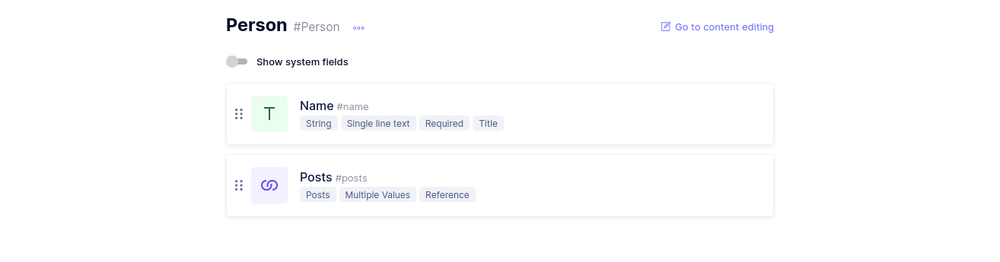
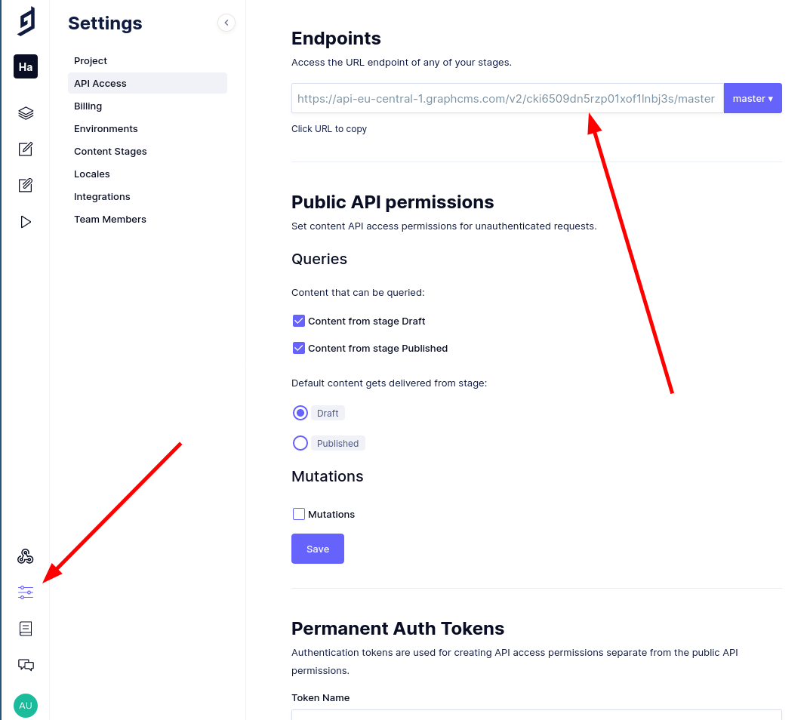

# Setup

In order to try out this GraphQL schema delegation demo you must carry out certains tasks by yourself:

1. Sign up at [GraphCMS](https://graphcms.com/) and create a project there.
2. Define a simple schema with two types `Post` and `Person`. We cannot use `User` because this type is reserved by GraphCMS. You can see how I defined them in the [Screenshots](#screenshots).
3. Write some content. E.g. I created two people `Bob` and `Alice` and wrote one post by `Bob`.
4. Save the URL to your ` GRAPH_CMS_ENDPOINT` in `.env`.
5. Make your GraphQL endpoint publicly accessible or create a permanent `GRAPH_CMS_API_TOKEN` token and save it in `.env`.
6. Store a JWT secret in `.env`.

## Screenshots

Type Post:

Type Person:

Get your `GRAPH_CMS_ENDPOINT` and optionally create a `GRAPH_CMS_API_TOKEN`:

