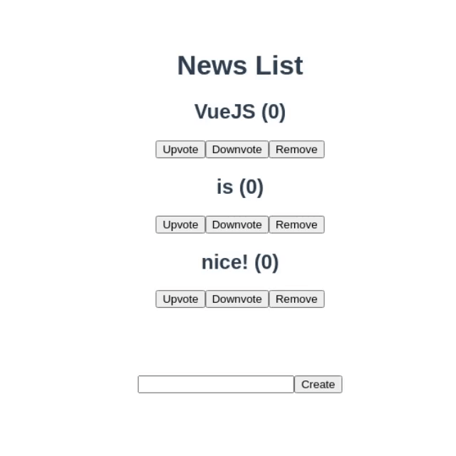

# VueJS

Due date: **28.10.2020**

## Goal

The goal is to reimplement some basic functionalities of [Hackernews](https://news.ycombinator.com/) in VueJS to learn the concepts.

Hacker News is a social news website focusing on computer science and entrepreneurship. Content can be submitted by users and can be interacted via upvotes or comments. We will focus on the startpage:

  

### Demo

This is how the result should look like:

  

You can use [Vue CLI](https://cli.vuejs.org/) for a quick setup which will setup [single file components](https://vuejs.org/v2/guide/single-file-components.html) for you.

Note that the official documentation of VueJS does not recommend using `vue-cli` but instead suggests to use a plain [index.html](https://github.com/vuejs/vuejs.org/blob/master/src/v2/examples/vue-20-hello-world/index.html) file.

Either way is fine, using `vue-cli` is easier but setting up VueJS yourself might be more educational.

Put your code somewhere in this repository. We suggest a monorepo approch with a folder `webapp` below the repository's root folder.

### Objectives

Each star gives one point if implemented satisfactorily.

:star: First of all, push new commits from `main` branch of the [homework repository](https://github.com/Systems-Development-and-Frameworks/homework/) to your team repository.

Implement a prototype using VueJS which contains:

:star: A list that renders a number of news items
- The initial list can be hard-coded
- Each item has a `title` and `votes`, the latter are 0 initially.

:star: Each item has a button to remove itself
- The item should not remove itself from the DOM but tell its parent component to do so.

:star: Each item has buttons to downvote or upvote itself, respectively
- Each item `$emit('update', item)` the updated item
- The parent component updates the list when an item is updated

:star: Below the list is a form to add new items to the list
- Prevent the default behaviour of a `<form>` html element which would execute a HTTP request on submit.

Make sure that your prototype has these properties:

:star: The items are always ordered by votes in descending order
- You could use computed properties for the list of ordered items
- `Array.prototype.sort` has side-effects. You can create a new array with `[...array]` destructuring.

:star: There are no runtime errors
- E.g. no duplicate keys

Furthermore:

:star: Components have clean responsibilities
- Data down, actions up

:star: Use functional programming paradigms, e.g.:
- [Array.prototype.find](https://developer.mozilla.org/en-US/docs/Web/JavaScript/Reference/Global_Objects/Array/find)
- [Array.prototype.filter](https://developer.mozilla.org/en-US/docs/Web/JavaScript/Reference/Global_Objects/Array/filter)
- [Array.prototype.map](https://developer.mozilla.org/en-US/docs/Web/JavaScript/Reference/Global_Objects/Array/map)

:star: Your PR does not contain unrelated changes
- Double check "Files changed" tab in your pull request
