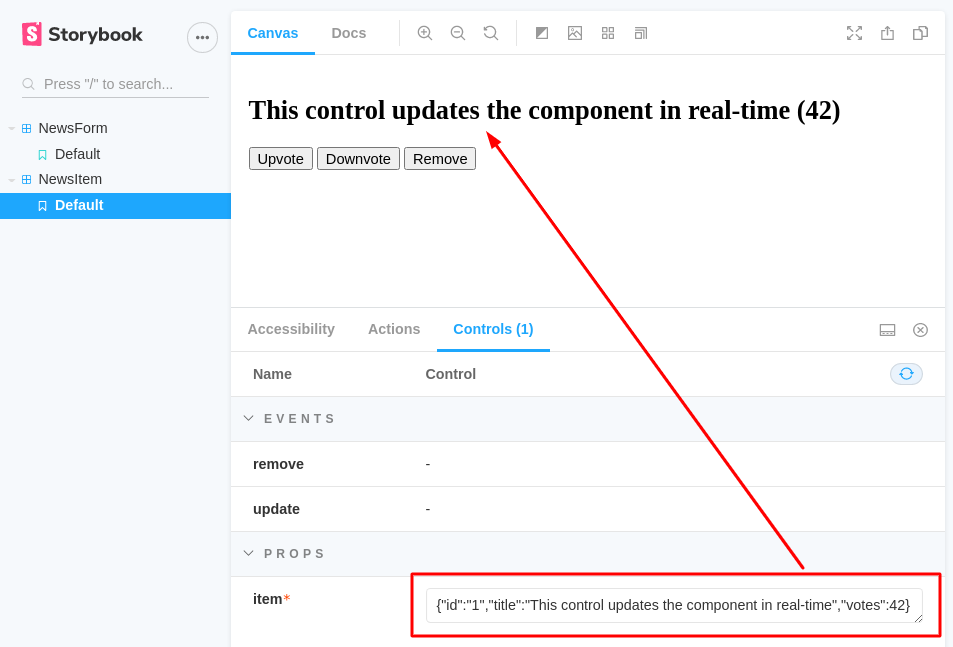
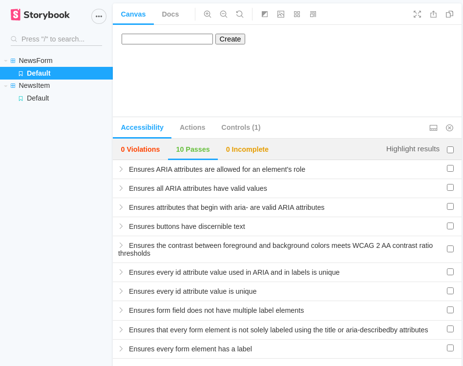

# Exercise #2

| Deadline                   | Date                   |
| -------------------------- | ---------------------- |
| Review due date (optional) | 04.11.2020 - 14:00     |
| **Final Due date**         | **11.11.2020 - 14:00** |

## Goal

You will learn test-driven-development (TDD) and how to setup your own build server for continuous integration and continuous deployment (CI/CD). Also you will learn how to do component-driven-development (CDD) using [Storybook](https://www.learnstorybook.com/).

Extend exercise #1 with the following objectives.

### Objectives
:star: Add a linter to your project, e.g. `eslint` and/or `prettier`.
- `yarn run lint` should fail in case of lint errors

:star: Test your components with [jest](https://jestjs.io/) and [vue-test-utils](https://vue-test-utils.vuejs.org/).
- `yarn run test:unit` runs all tests

Test-drive the following features:
- :star: When all items are deleted from the list, it shows sth. like "The list is empty :("
- :star: A button on the news list toggles between descending and ascending order

A sample output could look like this:
```
$ yarn run test --verbose
 PASS  src/components/NewsList/NewsList.spec.js
  NewsList.vue
    :initialItems
      empty
        ✓ renders empty state (14ms)
      not empty
        ✓ renders <NewsItem> for each item (5ms)
        click "Reverse order"
          ✓ toggles between ascending and descending order (14ms)
```

:star: [Configure jest](https://jestjs.io/docs/en/configuration) so that you can co-locate test and component files:
```
YourComponent/
  YourComponent.vue
  YourComponent.spec.js
```

:star: Setup a build server for continuous integration, use either [Github Actions](https://github.com/features/actions), [Travis CI](https://travis-ci.org/) or [Circle Ci](https://circleci.com/) (Github Actions is probably the easiest, but feel free to use what you're comfortable with)
- Your build server must:
  - check lint
  - check your tests
  - update [status checks](https://docs.github.com/en/free-pro-team@latest/github/collaborating-with-issues-and-pull-requests/about-status-checks) on all PRs to your repository

:star: Create a [storybook](https://storybook.js.org/docs/vue/get-started/install) for each of your VueJS components
- Co-locate storybook with component files:
```
YourComponent/
  YourComponent.vue
  YourComponent.spec.js
  YourComponent.stories.js
```
- Add storybook addons `@storybook/addon-essentials` along with `@storybook/addon-a11y`
- Hint: For setup you can run `npx sb init`

:star: Configure `@storybook/addon-controls` so that you can interactively update your components properties in real-time.
- Ensure `@storybook/addon-knobs` is not installed

:star: Make sure your components pass all accessiblity tests, including the component rendering the `<form>`


:star: Review a pull request of another team.
- Either "Request Changes" or "Approve" *do not just "Comment"*.
- Suggest changes to the code in "Files Changed" (you should learn how to do that).
- Request a review from another team as well

### Screenshots






### Optional objectives

In our lecture of October 21st 2020 we covered online open-source communities and git internals. These topics are not (yet) part of the current homework but will be a task in the upcoming homeworks and/or the final exam. So it's a great opportunity for you to practice the following:

:rocket: Record an online pair-programming.
- Choose someone who is not a member of your team, preferably some member of an open-source online community but a member of another team is fine, too.
- Record the pair-programming to [PeerTube](https://joinpeertube.org/en/) or [YouTube](https://www.youtube.com/) and send the link to the video to us
- Kudos if you publish the video :+1: otherwise mark the video as "unlisted"

:rocket: Ensure meaningful commit messages and `git commit --amend` your commits. (This is why we learned how git compares commits and which action will change the commit id)
