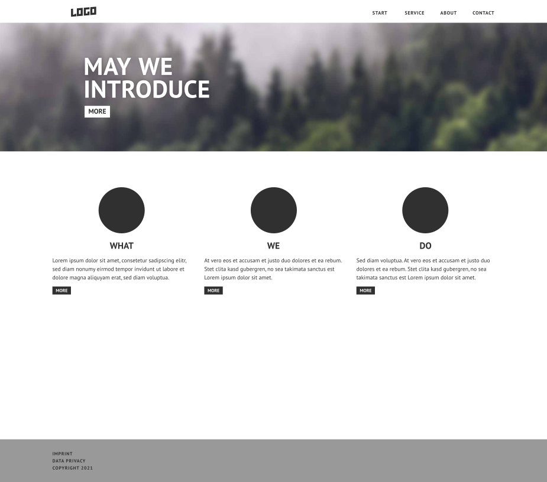
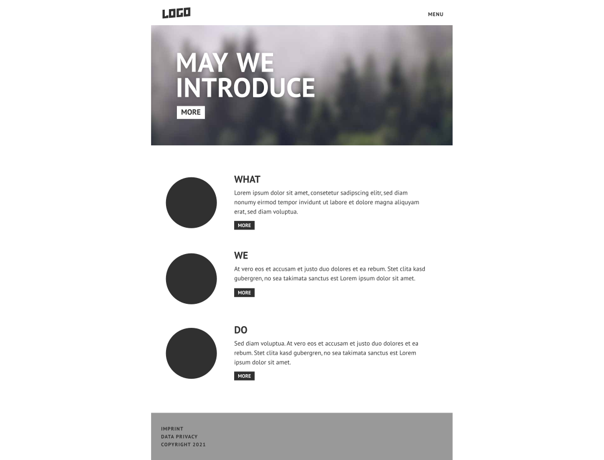
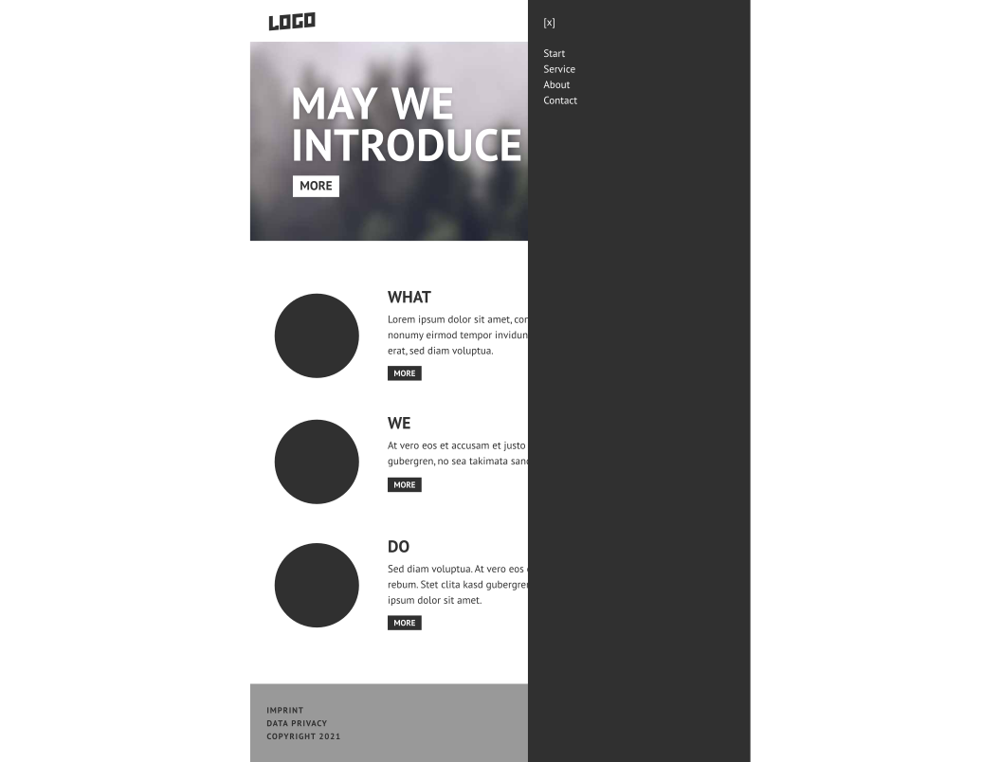

# Exercise #8

| Deadline                   | Date                   |
| -------------------------- | ---------------------- |
| **Final Due date**         | **03.02.2021 - 14:00** |

## Goal

In this exercise we practice how to implement a design specification given in the form of an image or document. You do not necessarily have to extend exercise 1-7 (this is optional, see [Optional Objectives](#optional-objectives)). Make it clear in your Pull Requests how we can build and test your solution. 

The goal is to implement a simplified [Holy Grail layout](https://en.wikipedia.org/wiki/Holy_grail_(web_design)) with a header, content and footer section. Header and content must be responsive. It is advised to make use of [media queries](https://developer.mozilla.org/en-US/docs/Web/CSS/Media_Queries/Using_media_queries) for responsiveness and [CSS grids](https://developer.mozilla.org/de/docs/Web/CSS/CSS_Grid_Layout) for the layout.

## Instructions

Discuss and decide in your team if you want to use a framework:
 * No framework, instead plain HTML/CSS (best for learning)
 * [TailwindCSS](https://tailwindcss.com/) - [nuxt-module](https://tailwindcss.nuxtjs.org/) (balance between flexibility and convenience)
 * [Vuetify](https://vuetifyjs.com/) - [nuxt-module](https://github.com/nuxt-community/vuetify-module) (most convenient solution)
 * Another framework like Bootstrap Vue, Buefy, Vue Material etc. Note that the mentors can only offer limited support on these solutions. 
 
 
 
Extend your hackernews app **or** setup a new project with the framework you choose and start implementing header, content and footer.

For big screens, the header must show all navigation links listed at the top. For smaller screens it must use a [hamburger menu](https://en.wikipedia.org/wiki/Hamburger_button) which reveals a [sidebar](https://en.wikipedia.org/wiki/Sidebar_(computing)) to show the same links.

For big screens, the content section must use a three column layout. For smaller screens it must use one column to show the same content.
The content section contains content items which constist of at least a title and a text. They have to change responsively as well. For big screens, the content items must use a 1-column layout. For smaller screens it must switch to a 2-column layout. (see images)

The footer section does not have to be responsive per se, but it must look good on both big and small screens. The content of the footer is up to you, but it must contain at least some text.

> Big screens/ big screens: laptops and larger
> 
> Small screens/smaller screens: everything smaller than laptops (tablets and smartphones)

Here is how the website should look like:

### Large screen

### Small screen

### Small screen with revealed sidebar

## Objectives

:star: For a header and it's responsiveness (direct links vs. hamburger menu)

:star: For a content section and it's content items

:star: For a responsive content section (3-column vs 1-column layout)

:star: For responsive content items (1-column vs. 2-column layout)

:star: For a footer

All objectives must be implemented according to the [instructions](#instructions).

## Optional Objectives

:rocket: For extending exercise 1-7 (instead of creating a new project) and adapting the content section (to contain title and votes)

:rocket: For requesting a review and reviewing another team's PR.

:rocket: For using [BEM](https://getbem.com/) or [rscss](https://rscss.io/) or a similar CSS ruleset to keep your CSS specificity low.

:rocket: For a sidebar containing all the navigation links. The sidebar is revealed when the hamburger menu button is clicked and can be closed.

:rocket: For a smooth transition when the sidebar is revealed or hidden. Use [VueJS transitions](https://vuejs.org/v2/guide/transitions.html).

:rocket: For using [semantic html](https://medium.com/@zac_heisey/7-alternatives-to-the-div-html-tag-7c888c7b5036).
